# Tiling 2: Matrix Multiplication, Convolution, and LU Decomposition

This repository explores performance optimization techniques for compute-intensive kernels (Matrix Multiplication, 2D Convolution, and LU Decomposition) on Apple Silicon (M1 Pro/Max).

## System Architecture: M1 Cache Settings

Understanding the cache hierarchy is crucial for tiling optimizations.

```
# sysctl -a | grep -i cache 
hw.perflevel0.l1icachesize: 196608
hw.perflevel0.l1dcachesize: 131072
hw.perflevel0.l2cachesize: 12582912 (12MB)
hw.perflevel1.l1icachesize: 131072
hw.perflevel1.l1dcachesize: 65536
hw.perflevel1.l2cachesize: 4194304 (4MB)
```
*   **Performance Cores (P-cores):** 128KB L1 Data, 12MB L2 (shared).
*   **Efficiency Cores (E-cores):** 64KB L1 Data, 4MB L2 (shared).

## Code Structure

*   **Kernels:**
    *   `matmul_core.c`: GEMM implementations (Naive, Tiled, Advanced).
    *   `convolution_core.c`: 2D Convolution implementations.
    *   `lu_core.c`: LU Decomposition implementations.
*   **Drivers:** `*_runner.c` files manage memory, timing, and validation.
*   **Scripts:** `exp_*.sh` scripts run parameter sweeps (N, T, K) and log results to CSV.
*   **Plotting:** `plot_results.py` visualizes the CSV data.

## Experiment Parameters

*   **N (Problem Size):** The dimension of the input data.
    *   For Matrix Multiplication: $N \times N$ matrices.
    *   For Convolution: $N \times N$ input image.
    *   For LU Decomposition: $N \times N$ matrix.
*   **T (Tile Size):** The block size used for cache tiling.
    *   The loops are blocked into chunks of size $T \times T$ to fit into the L1/L2 cache.
    *   Optimal $T$ minimizes cache misses.
*   **K (Kernel Size):** The dimension of the convolution filter.
    *   Only applicable to Convolution.
    *   The filter size is $K \times K$.

## Experiment Settings

We conducted two sets of experiments to evaluate the impact of algorithmic optimizations (Tiling, Register Blocking) and hardware parallelism (OpenMP).

### 1. Baseline Experiments (Without OpenMP)
These experiments focus on single-threaded performance to isolate the benefits of cache locality and instruction-level parallelism.

*   **Threading:** Single-threaded (1 core).
*   **Compiler Flags:** `-O3 -march=native` (Enables vectorization and architecture-specific tuning).
*   **Implementations:**
    *   `naive`: Straightforward nested loops. Prone to cache thrashing for large inputs.
    *   `tiled`: Loop blocking to fit data subsets into L1/L2 cache.
    *   `advanced`: Combines cache tiling with **Register Blocking**. A 4x4 micro-kernel computes a small patch of the output entirely in registers to minimize load/store operations.

### 2. OpenMP Experiments (With OpenMP)
These experiments leverage the multi-core architecture of the Apple M1.

*   **Threading:** Multi-threaded (Uses all available cores).
*   **Compiler Flags:** `-Xpreprocessor -fopenmp -O3 -march=native`.
*   **Library:** Linked against LLVM OpenMP (`libomp`) installed via Homebrew.
*   **Parallelization Strategy:**
    *   Applied `#pragma omp parallel for collapse(2) schedule(static)` to the outer tile loops (`ii` and `jj`).
    *   This distributes independent tiles across threads.
    *   Thread-local variables were ensured to prevent data races.
*   **Implementations:**
    *   `tiled`: Parallelized version of the cache-tiled code.
    *   `advanced`: Parallelized version of the register-blocked code.

## Results & Analysis

Results are organized into `results_wo_omp/` (single-threaded) and `results_w_omp/` (multi-threaded).

### Performance Deep Dive

Generally, we expect the performance hierarchy: **Advanced > Tiled > Naive**. However, experimental results show interesting nuances.

#### 1. Why Advanced > Tiled > Naive? (The General Case)
This trend is clearly visible in **Matrix Multiplication** and **Convolution** for large inputs.
*   **Naive (Baseline):** Suffers from frequent cache misses. As $N$ grows, rows/columns are evicted from the cache before they can be reused.
*   **Tiled (Cache Locality):** optimizing for the **L1/L2 Cache**. By blocking loops to size $T$, we ensure the working set fits in the fast cache memory, reducing DRAM access latency.
    *   *Observation:* In GEMM (N=2048), Tiled is ~10x faster than Naive.
*   **Advanced (Register Locality):** Optimizing for **CPU Registers**. Even L1 cache access takes cycles. The Advanced kernel uses a 4x4 micro-kernel to keep accumulators in registers, minimizing load/store instructions and maximizing arithmetic intensity per cycle.
    *   *Observation:* In GEMM, Advanced reaches ~134 GFLOP/s vs ~14 GFLOP/s for Tiled.

#### 2. Why Naive > Tiled/Advanced? (Small N)
*   **Observation:** At $N=64$, Naive is often the fastest.
*   **Reason:** When the entire problem fits in the L1 cache anyway, tiling provides no benefit. Instead, the overhead of tiling logic (complex loop bounds, min/max calculations) and function calls dominates the runtime. The simple control flow of the Naive loop allows the CPU pipeline to run most efficiently.

#### 3. Why Tiled > Advanced? (LU Decomposition)
*   **Observation:** In the OpenMP LU experiments, `tiled` (~59 GFLOP/s) outperforms `advanced` (~45 GFLOP/s).
*   **Reason:** LU Decomposition involves complex data dependencies (triangular solves) that are harder to optimize with a rigid rectangular micro-kernel.
    *   **Compiler Optimization:** The "Tiled" implementation exposes simple loops that the Clang compiler can aggressively auto-vectorize (using M1's NEON instructions).
    *   **Micro-Kernel Overhead:** The "Advanced" manual micro-kernel might introduce overhead (e.g., handling edge cases or register spilling) that outweighs its benefits for this specific algorithm structure.

### Matrix Multiplication (GEMM)
*   **Impact of Tiling:** Tiling significantly improves performance over naive for large $N$ by maintaining cache locality.
*   **Impact of OpenMP:** The parallel `advanced` implementation achieves the highest throughput, scaling well with problem size.
*   **Plots:**

    **No OpenMP (Baseline)**  
    <p float="left">
      
      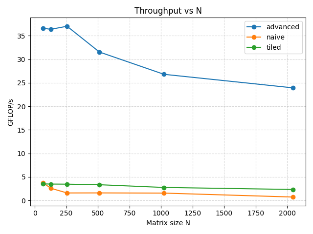 
    </p>
    <p float="left">
      
      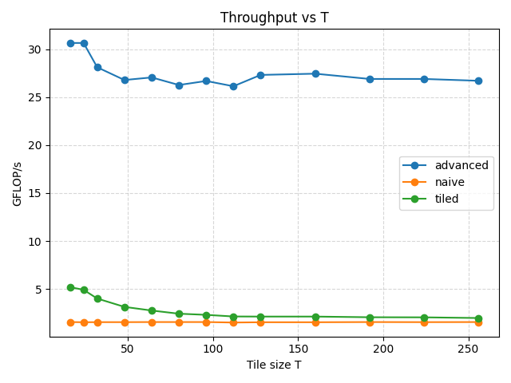
    </p>

    **With OpenMP**  
    <p float="left">
      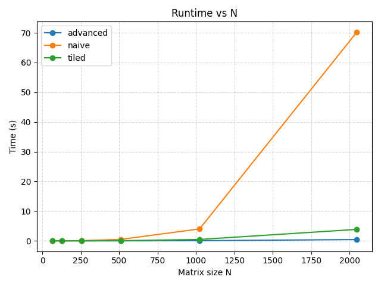
      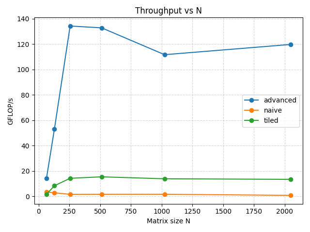
    </p>
    <p float="left">
      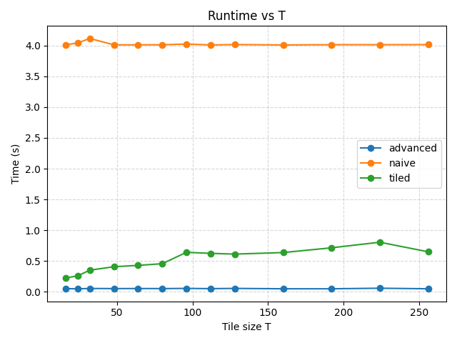
      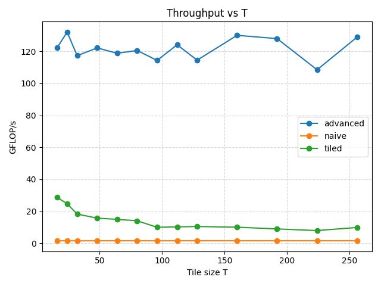
    </p>

### 2D Convolution
*   **Kernel Size (K):** Performance scales with kernel size. Larger kernels offer more arithmetic intensity.
*   **Parallelism:** OpenMP provides a near-linear speedup for the `advanced` implementation, reaching ~20+ GFLOP/s on the M1.
*   **Plots:**

    **No OpenMP (Baseline)**  
    <p float="left">
      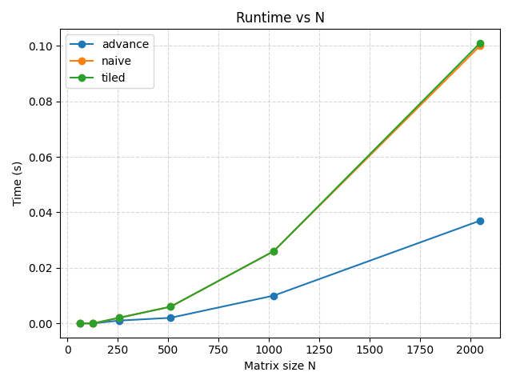
      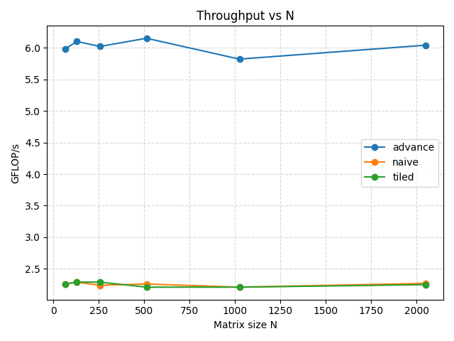
    </p>
    <p float="left">
      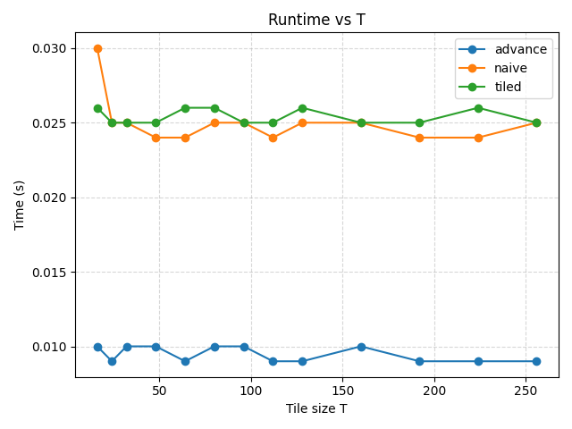
      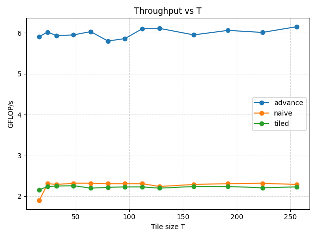
    </p>
    <p float="left">
      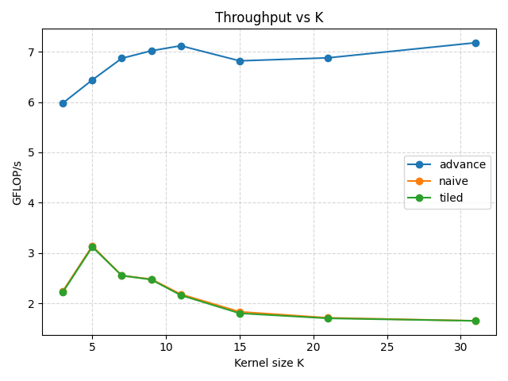
      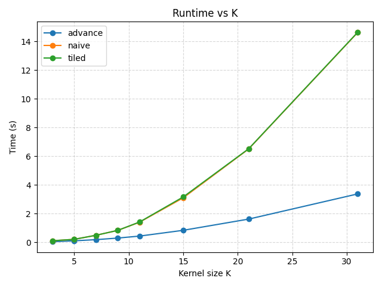
    </p>

    **With OpenMP**  
    <p float="left">
      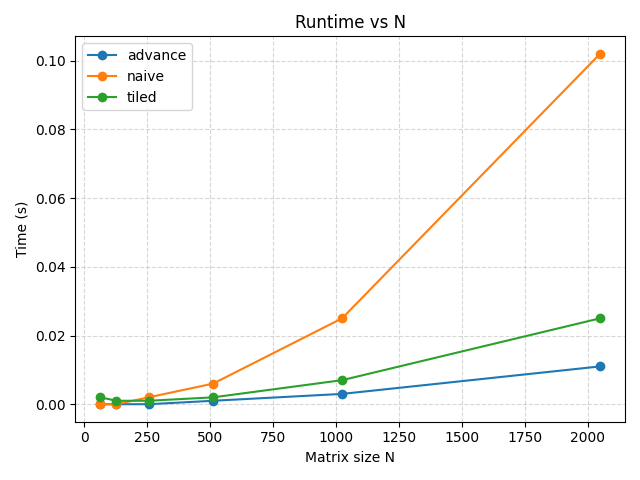
      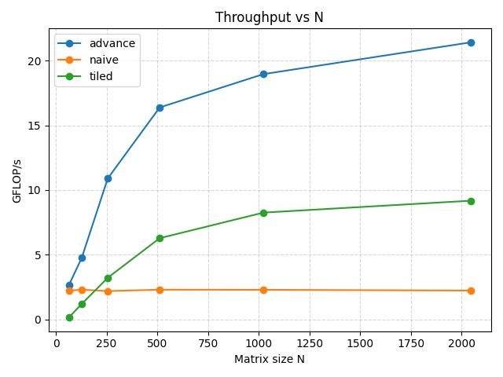
    </p>
    <p float="left">
      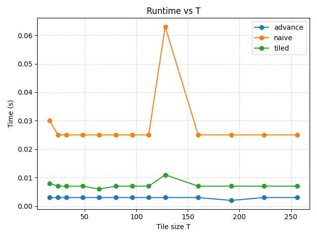
      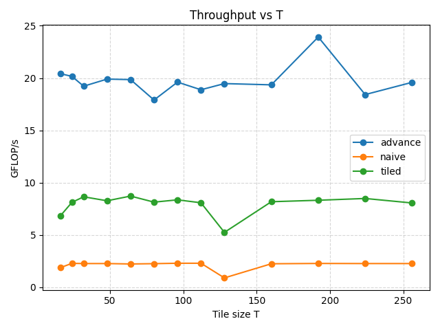
    </p>
    <p float="left">
      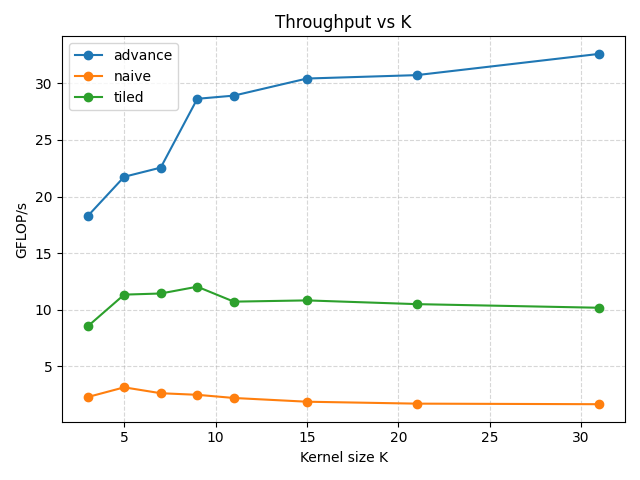
      
    </p>

### LU Decomposition
*   LU factorization is more challenging to parallelize due to data dependencies.
*   The `advanced` implementation with OpenMP still outperforms the naive baseline significantly.
*   **Plots:**

    **No OpenMP (Baseline)**  
    <p float="left">
      
       
    </p>
    <p float="left">
      
      
    </p>

    **With OpenMP**  
    <p float="left">
      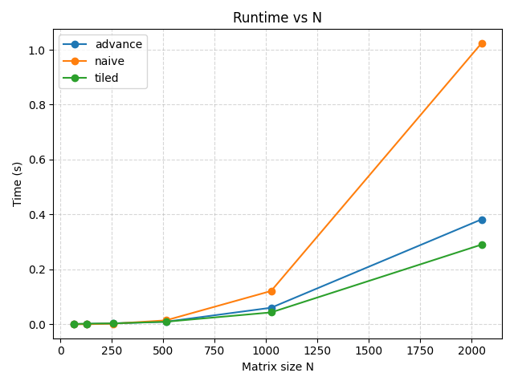
      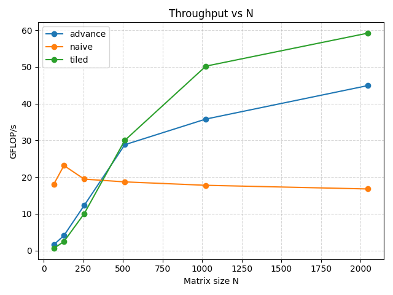
    </p>
    <p float="left">
      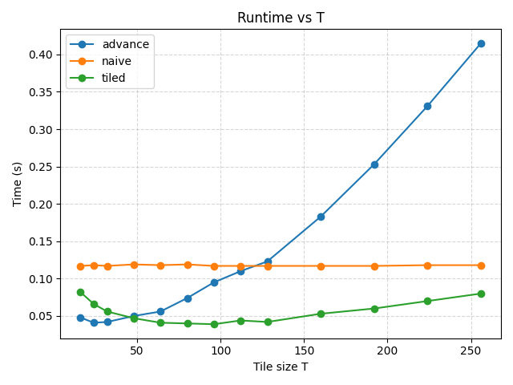
      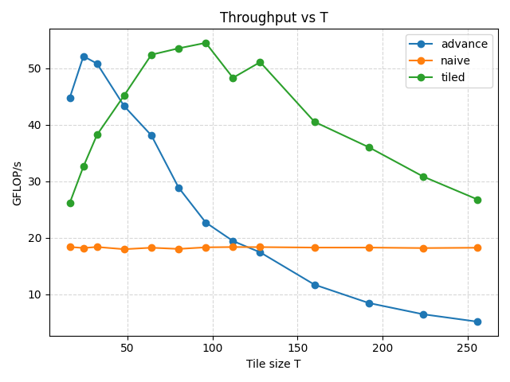
    </p>

## How to Run

### Prerequisites
*   **Compiler:** clang (with OpenMP support).
*   **Dependencies:** `libomp` (install via `brew install libomp`).
*   **Python:** `matplotlib` for plotting.

### Running Experiments
```bash
# Matrix Multiplication
./exp_on_n.sh       # Sweep Size N
./exp_on_t.sh       # Sweep Tile Size T

# Convolution
./exp_conv_on_n.sh  # Sweep Size N
./exp_conv_on_t.sh  # Sweep Tile Size T
./exp_conv_on_k.sh  # Sweep Kernel Size K

# LU Decomposition
./exp_lu_on_n.sh    # Sweep Size N
./exp_lu_on_t.sh    # Sweep Tile Size T
```

### Generating Plots
```bash
python3 plot_results.py --results-n results_n_omp.csv --results-t results_t_omp.csv --out-dir plots
```
